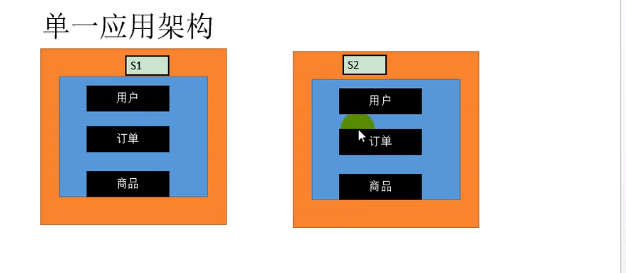
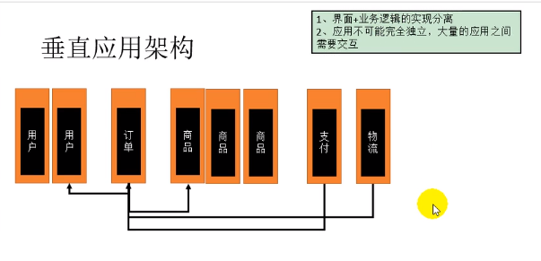
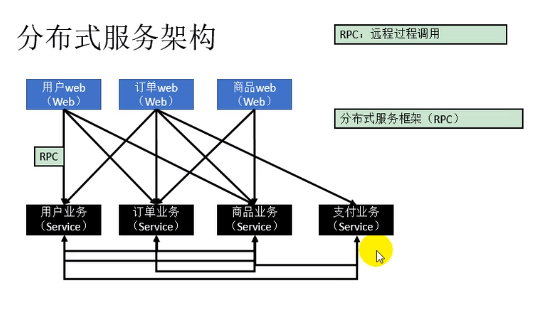
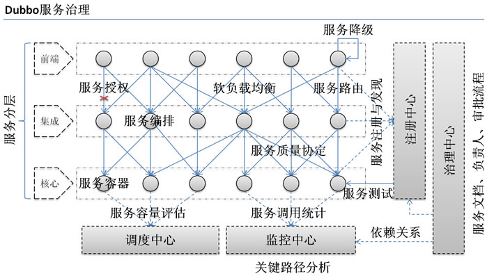

# 02_Dubbo\_概念_应用的架构演变

## 发展演变

### 单一应用架构

当网站流量很小的时候，只需要一个应用就可以把所有功能部署在一起，以减少部署节点和成本。此时，用于简化增删改查工作量的数据访问框架（ORM）是关键。

在以往单一应用架构的时候，如果访问量过大，就通过部署新的服务器来解决，但是随着应用不断扩展，应用的大小也不断扩大，单纯的整个应用扩展也不是一个好的方法。

### 垂直应用架构

当访问量逐渐增大，单一应用增加机器带来的加速度越来越小，将应用拆成互不相干的几个应用，以提升效率。此时，用于加速前端页面开发的Web框架(MVC)是关键。

为了改进单一应用架构带来的扩展负担问题，可以把单一应用进行功能拆分，在某个功能模块需要扩张的时候，只对该需求量大的功能模块进行扩张，而不是所有都进行扩张。

问题：

1. 界面和业务逻辑的实现分离。
2. 应用不可能完全独立，大量的应用之间需要交互。

### 分布式架构

当垂直应用越来越多，应用之间交互不可避免，将核心业务抽取出来，作为独立的服务，逐渐形成稳定的服务中心，使前端应用能更快速的响应多变的市场需求。此时，用于提高业务复用及整合的分布式服务框架(RPC)是关键。

调用的方法是RPC：远程过程调用

分布式服务架构（RPC）

问题：

不能动态调度资源，如动态调度单应用的服务数量。

### 流动计算架构

当服务越来越多，容量的评估，小服务资源的浪费等问题逐渐显现，此时需增加一个调度中心基于访问压力实时管理集群容量，提高集群利用率。此时，用于提高机器利用率的资源调度和治理中心(SOA)是关键。

## 需求

在大规模服务化之前，应用可能只是通过 RMI 或 Hessian 等工具，简单的暴露和引用远程服务，通过配置服务的URL地址进行调用，通过 F5 等硬件进行负载均衡。

**当服务越来越多时，服务 URL 配置管理变得非常困难，F5 硬件负载均衡器的单点压力也越来越大。** 此时需要一个服务注册中心，动态地注册和发现服务，使服务的位置透明。并通过在消费方获取服务提供方地址列表，实现软负载均衡和 Failover，降低对 F5 硬件负载均衡器的依赖，也能减少部分成本。

**当进一步发展，服务间依赖关系变得错踪复杂，甚至分不清哪个应用要在哪个应用之前启动，架构师都不能完整的描述应用的架构关系。** 这时，需要自动画出应用间的依赖关系图，以帮助架构师理清理关系。

**接着，服务的调用量越来越大，服务的容量问题就暴露出来，这个服务需要多少机器支撑？什么时候该加机器？** 为了解决这些问题，第一步，要将服务现在每天的调用量，响应时间，都统计出来，作为容量规划的参考指标。其次，要可以动态调整权重，在线上，将某台机器的权重一直加大，并在加大的过程中记录响应时间的变化，直到响应时间到达阈值，记录此时的访问量，再以此访问量乘以机器数反推总容量。

以上是 Dubbo 最基本的几个需求。