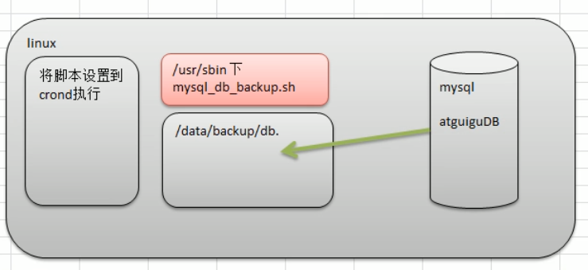

# 04_Linux_Shell

1. Linux运维工程师在进行服务器集群管理的时候，需要编写shell程序来进行服务器管理。
2. 对于JavaEE和Python程序员来说，工作的需要，要求写一些shell脚本进行程序或服务器的维护，比如编写定时备份数据库的脚本。
3. 对于大数据程序员来说，需要编写shell程序来管理集群。

## Shell是什么

Shell是一个命令行解释器，为用户提供了一个向Linux内核发送请求以便运行程序的界面系统级程序，用户可以用shell来启动、挂起、停止甚至是编写一些程序。


## Shell脚本的执行方式

脚本格式要求：

- 脚本以#!/bin/bash开头
- 脚本需要有可执行权限

脚本的常用执行方式：

1. 输入脚本的绝对路径或相对路径，需要执行权限 
2. sh+脚本，不需要执行权限

```shell
#!/bin/bash
echo "hello,world!"
```

## Shell的变量

### shell变量的介绍

1. Linux Shell中的变量分为，系统变量和用户自定义变量。
2. 系统变量：$HOME、$PWD、$SHELL、$USER等等，比如echo $HOME；
3. 显示当前shell中所有变量：set

### shell变量的定义

基本语法：

1. 定义变量：变量=值
2. 撤销变量：unset 变量
3. 声明静态变量：readonly 变量，**注意：不能unset**


案例：

1. 定义变量A，撤销变量A

   ```shell
   A=100
   echo "A=$A"
   unset A
   echo "A=$A"
   ```

2. 声明静态变量B=2，不能unset

   ```shell
   readonly B=2
   echo "B=$B"
   unset B
   echo "B=$B"
   ```

   会报错，不可以unset静态变量，但是可以继续执行。

3. 可把变量提升为全局环境变量，供其他shell程序使用


定义变量的规则：

1. 变量名称可以由字母、数字和下划线组成，但是不能以数字开头。
2. 等号两侧不能有空格
3. 变量名称一般习惯为大写


将命令的返回值赋给变量

1. A=\`ls -la\`反引号（键盘左上角），运行里面的命令，并把结果返回给变量A
2. A=$(ls -la)等价于反引号


### 设置环境变量

基本语法：

1. export 变量名=变量值：将shell变量输出为环境变量
2. source 配置文件：让修改后的配置信息立即生效
3. echo $变量名：查询环境变量的值


案例：

1. 在/etc/profile文件中定义TOMCAT_HOME环境变量
2. 查看环境变量TOMCAT_HOME的值
3. 在另外一个shell程序中使用TOMCAT_HOME

注意：在输出TOMCAT_HOME环境变量前，需要让其生效：source /etc/profile


### 位置参数变量

当我们执行一个shell脚本的时候，如果希望得到命令行的参数信息，就可以用到位置参数变量

比如：./myshell.sh 100 200，这个就是一个执行shell的命令行，可以在myshell脚本中获取到参数信息


基本语法：

- $n：n为数字，$0表示命令本身，$1-$9表示第一个到第九个参数，十以上的参数需要用大括号包含，如${10}
- $\*：这个变量代表命令行中所有的参数，**$*把所有的参数看成一个整体**
- $@：这个变量代表命令行中所有的参数，**$@把每个参数区分对待**
- $#：这个变量代表命令行中所有参数的个数


案例：

编写一个shell脚本positionParam.sh，在脚本中获取到命令行的各个参数信息

```shell
#!/bin/bash
echo $0
echo $1
echo $2
echo $*
echo $@
echo $#
```

输出：

```
[root@localhost shell]# ./positionParam.sh 100 200
./positionParam.sh
100
200
100 200
100 200
2
```


### 预定义变量

就是shell设计者事先定义好的变量，可以直接在shell脚本中使用


基本语法：

- \$\$：当前进程的进程号（PID）
- $!：后台运行的最后一个进程的进程号（PID）
- $?：最后一次执行的命令的返回状态，如果这个变量的值为0，证明上一个命令正确执行，如果这个变量的值部位0（具体是哪个数，由命令自己决定），则证明上一个命令执行不正确。


案例：

&以后台的方式执行

shell脚本：

```shell
#!/bin/bash
echo "当前的进程号=$$"
echo "后台运行myShell.sh"
./myShell.sh &
echo "最后的进程号=$!"
echo "执行的值是=$?"
```

结果：

```shell
[root@localhost shell]# ./parVar.sh 
当前的进程号=2661
后台运行myShell.sh
最后的进程号=2662
执行的值是=0
[root@localhost shell]# total 12 -rwxr--r--. 1 root root 223 Oct 5 19:58 myShell.sh -rwxr--r--. 1 root root 141 Oct 5 20:09 parVar.sh -rwxr--r--. 1 root root 60 Oct 5 20:00 positionParam.sh

Sat Oct 5 20:10:52 PDT 2019

date=Sat Oct  5 20:10:52 PDT 2019
```


## 运算符

基本语法：

1. $((运算式))或$[运算式]
2. expr m + n（**注意expr运算符间要有空格**）
3. expr m - n
4. expr \*,/,%：乘除取余

案例：

1. 算（2+3）*4的值

   ```shell
   #!/bin/bash
   RESULT1=$(((2+3)*4))
   echo $RESULT1
   
   RESULT2=$[(2+3)*4]
   echo $RESULT2
   
   TEMP=`expr 2 + 3`
   RESULT3=`expr $TEMP \* 4`
   echo $RESULT3
   ```

2. 求两个参数的和

   ```shell
   SUM=$[$1+$2]
   echo $SUM
   ```


## 条件判断

基本语法：

[ condition ]（注意condition前后要有空格）

如果非空就返回true，可以用$?验证（0为false，>1为false）

案例：

[ tomxwd ]：true

[]：false

[ condition ]&&echo OK||echo notok


两个整数比较：

| 符号 | 描述       |
| ---- | ---------- |
| =    | 字符串比较 |
| -lt  | 小于       |
| -le  | 小于等于   |
| -eq  | 等于       |
| -gt  | 大于       |
| -ge  | 大于等于   |
| ne   | 不等于     |

按照文件权限进行判断

| 符号 | 描述         |
| ---- | ------------ |
| -r   | 有读的权限   |
| -w   | 有写的权限   |
| x    | 有执行的权限 |

按照文件类型进行判断

| 符号 | 描述                         |
| ---- | ---------------------------- |
| -f   | 文件存在并且是一个常规的文件 |
| -e   | 文件存在                     |
| -d   | 文件存在并且是一个目录       |

案例：

- “ok”是否等于“ok“

  ```shell
  #!/bin/bash
  if [ "ok"="ok" ]
  then 
  	echo "equal"
  fi
  ```

- 23是否大于等于22

  ```shell
  if [ 23 -gt 22 ]
  then 
  	echo ">"
  fi
  ```

- /root/install.log目录中的文件是否存在

  ```shell
  if [ -e /root/Desktop/shell/aaa.txt ]
  then 
  	echo "存在"
  fi
  ```


## 流程控制

### if判断

基本语法：

if [ 条件判断式 ];then

​	程序

fi

或者

if [ 条件判断式 ]

​	then

​	程序

​	elif [ 条件判断式 ]

​	then

​	程序

fi


注意事项：

1. [ 条件判断式 ]，中括号和条件判断式之间必须有空格
2. 推荐第二种写法


案例：

写一个shell脚本，如果输入的参数大于等于60，就输出及格了，如果小于60则不及格。

```shell
#!/bin/bash
if [ ${1} -ge 60 ]
then
        echo "及格了"
elif [ ${1} -lt 60 ]
then
        echo "不及格"
fi
```


### case语句

基本语法：

case $变量名 in

"值1")

如果变量的值等于值1，则执行程序1

;;

"值2")

如果变量的值等于值2，则执行程序2

;;

*）

如果变量的值不等于任意一个，则执行以下

;;

esac


实例：

命令行参数是1的时候，输出"周一"，是2的时候，输出"周二"，其他输出"other"：

```shell
#!/bin/bash
case $1 in
"1")
echo "周一"
;;
"2")
echo "周二"
;;
*)
echo "other"
;;
esac
```


### for循环

基本语法：

- 第一种：

  for 变量 in 值1 值2 值3...

  do

  ​	程序

  done

- 第二种：

  for(( 初始值;循环控制条件;变量变化 ))

  do

  ​	程序

  done

  

实例：

- 第一种：

  打印命令行输入的参数

  ```shell
  #!/bin/bash
  for i in "$@"
  do
  	echo "the num is $i"
  done
  ```

- 第二种：

  从1加到100的值输出显示，这里可以看出$*和$@的区别

  ```shell
  #!/bin/bash
  SUM=0
  for((i=1;i<=100;i++))
  do
  	SUM=$[ $SUM+$i ]	
  done
  echo $SUM
  ```

  

### while循环

基本语法：

while[ 条件判断式 ]

do

​	程序

done


案例：

从命令行输入一个数n，计算1+...+n的值

```shell
#!/bin/bash
i=1
SUM=0
while [ $i -le ${1} ]
do
	SUM=$[$SUM+$i]
	i=$[$i+1]
done
echo "sum=$SUM"
```


## read读取控制台输入

基本语法：

read（选项）（参数）

选项：

- -p：指定读取值时的提示符
- -t：指定读取值时等待的时间（秒），如果没有在指定的时间内输入，就不等待了

参数：

变量：指定读取值的变量名


案例：

1. 读取控制台输入一个num值
2. 读取控制台输入一个num值，在10秒内输入

```shell
#!/bin/bash

read -p "请输入一个数字num1=" NUM1
echo "你输入的值是 num1=$NUM1"


read -t 10 -p "请输入一个数字num2=" NUM2
echo "你输入的值是 num2=$NUM2"
```


## 函数

shell编程和其他编程语言一样，有系统函数，也可以自定义函数。


系统函数：

- basename基本语法

  - 功能：返回完整路径最后/的部分，常用于获取文件名
    - basename [pathname] [suffix]
    - basename [string] [suffix]
    - basename命令会删掉所有的前缀包括最后一个/字符，然后将字符串显示出来

  - 选项：

    - suffix为后缀，如果指定了suffix，basename会将pathname或string中的suffix去掉

  - 案例：
    - 请返回/home/aaa/test.txt的test.txt部分

      直接在命令行就可以：basename /home/aaa/test.txt

      甚至后缀都不要：basename /home/aaa/test.txt .txt

- dirname基本语法

  - 功能：返回完整路径最后/的前面部分，常用于返回路径部分

    - dirname 文件绝对路径
    - 从给定的包含绝对路径的文件名中去除文件名（非目录的部分），然后返回剩下的路径（目录的部分）

  - 案例：

    - 请返回/home/aaa/test.txt中的/home/aaa

      dirname /home/aaa/test.txt


自定义函数：

- 基本语法

  [ function ] funname[()]

  {

  ​	Action;

  ​	[return int;]

  }

  调用直接写函数名：funname [值]

- 案例：

  - 计算输入的两个参数的和

  ```shell
  #!/bin/bash
  function getSum(){
  	SUM=$[$n1+$n2]
  	echo "和是=$SUM"
  }
  
  read -p "请输入第一个数n1" n1
  read -p "请输入第二个数n2" n2
  
  getSum $n1 $n2
  ```


## 综合案例

需求：

1. 每天凌晨2:10备份数据库tomxwdDB到/data/backup/db
2. 备份开始和备份结束能够给出相应的提示信息
3. 备份后的文件要求以备份时间为文件名，并打包成.tar.gz的形式，比如：2019-10-6_230201.tar.gz
4. 在备份的同时，检查是否有10天前备份的数据库文件，如果有就将其删除

思路：



shell脚本内容：

```shell
#!/bin/bash

# 完成数据库的定时备份

# 备份的路径
BACKUP=/data/backup/db

#当前的时间作为文件名
DATETIME=$(date +%Y_%m_%d_%H%M%S)
# 可以输出变量调试
# echo $DATETIME

echo "============开始备份============"
echo "============备份的路径是$BACKUP/$DATETIME.tar.gz"

# 主机
HOST=localhost
# 用户名
DB_USER=root
# 密码
DB_PWD=tomxwd
# 需要备份的数据库名
DATABASE=tomxwdDB
# 创建备份的路径
# 如果备份的目录不存在，则创建
[ ! -d "$BACKUP/$DATETIME" ] && mkdir -p "$BACKUP/$DATETIME"
# 执行mysql的备份数据库指令 这里是临时目录
mysqldump -u${DB_USER} -p${DB_PWD} --host=${HOST} $DATABASE | gzip > $BACKUP/$DATETIME/$DATETIME.sql.gz

# 打包备份文件
cd $BACKUP
tar -zcvf $DATETIME.tar.gz $DATETIME

# 删除临时目录
rm -rf $BACKUP/$DATETIME

# 删除十天前的备份文件
find $BACKUP -mtime +10 -name "*.tar.gz" -exec rm -rf {} \;

echo "=============备份文件成功============="
```

最后需要放到crond中：

crontab -e

内容：

```shell
10 2 * * * /usr/sbin/mysql_db_backup.sh
```

