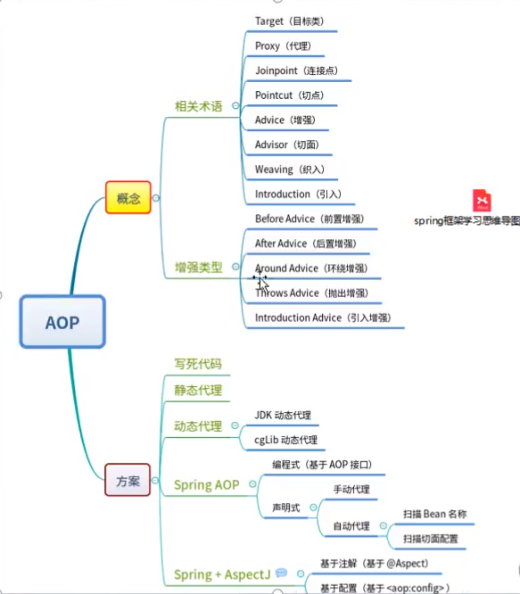

# 01_Spring_AOP

与OOP（Object Oriented Programming面向对象）相比，传统的OOP开发中的代码逻辑是自上向下的，而在这些自上而下的过程中产生横切性的问题，而这些横切性的问题又与我们的业务逻辑关系不大，会散落在代码的各个地方，造成难以维护。

AOP的编程思想是把这些横切性的问题和主业务逻辑进行分离，从而起到解耦的目的。


## 使用

首先导入织入包：

```xml
<dependency>
    <groupId>org.aspectj</groupId>
    <artifactId>aspectjweaver</artifactId>
</dependency>
```

用`@EnableAspectJAutoProxy`或者`<aop:aspectj-autoproxy/>`开启。



编写一个切面组件：

```java
/**
 * @author xieweidu
 * @createDate 2019-10-20 13:51
 */
@Aspect
@Component
@Slf4j
public class MyAspect {

    @Pointcut("execution(* top.tomxwd.controller.*.*(..))")
    private void pointcut() {

    }

    @Around("top.tomxwd.config.aop.MyAspect.pointcut()")
    public Object around(ProceedingJoinPoint pjp){
        long start = System.currentTimeMillis();
        Object proceed = null;
        try {
            proceed = pjp.proceed();
        } catch (Throwable throwable) {
            throwable.printStackTrace();
        }
        long end = System.currentTimeMillis();
        log.info("执行时间为{}",end-start);
        return proceed;
    }

    @Before("top.tomxwd.config.aop.MyAspect.pointcut()")
    public void before(){
        System.out.println("-------------------before-------------------");
    }

    @After("top.tomxwd.config.aop.MyAspect.pointcut()")
    public void after(){
        System.out.println("-------------------after--------------------");
    }

}
```

debug源码发现是在后置处理器的时候进行aop动态代理的。


为什么jdk动态代理必须是接口？

```java
public class ProxyTest {

    public static void main(String[] args) {
        byte[] proxyClassFile = ProxyGenerator.generateProxyClass("$Proxy", new Class[]{UserService.class});
        try {
            FileOutputStream fileOutputStream = new FileOutputStream("MyProxy.class");
            fileOutputStream.write(proxyClassFile);
            fileOutputStream.flush();
            fileOutputStream.close();
            System.out.println("writer完毕");
        } catch (FileNotFoundException e) {
            e.printStackTrace();
        } catch (IOException e) {
            e.printStackTrace();
        }

    }
}
```

查看输出的MyProxy.class反编译后的结果：

```java
public final class $Proxy extends Proxy implements UserService {
    private static Method m1;
    private static Method m4;
    private static Method m2;
    private static Method m3;
    private static Method m0;

    public $Proxy(InvocationHandler var1) throws  {
        super(var1);
    }

    public final boolean equals(Object var1) throws  {
        try {
            return (Boolean)super.h.invoke(this, m1, new Object[]{var1});
        } catch (RuntimeException | Error var3) {
            throw var3;
        } catch (Throwable var4) {
            throw new UndeclaredThrowableException(var4);
        }
    }

    public final List userList() throws  {
        try {
            return (List)super.h.invoke(this, m4, (Object[])null);
        } catch (RuntimeException | Error var2) {
            throw var2;
        } catch (Throwable var3) {
            throw new UndeclaredThrowableException(var3);
        }
    }

    public final String toString() throws  {
        try {
            return (String)super.h.invoke(this, m2, (Object[])null);
        } catch (RuntimeException | Error var2) {
            throw var2;
        } catch (Throwable var3) {
            throw new UndeclaredThrowableException(var3);
        }
    }

    public final Integer saveUser(User var1) throws  {
        try {
            return (Integer)super.h.invoke(this, m3, new Object[]{var1});
        } catch (RuntimeException | Error var3) {
            throw var3;
        } catch (Throwable var4) {
            throw new UndeclaredThrowableException(var4);
        }
    }

    public final int hashCode() throws  {
        try {
            return (Integer)super.h.invoke(this, m0, (Object[])null);
        } catch (RuntimeException | Error var2) {
            throw var2;
        } catch (Throwable var3) {
            throw new UndeclaredThrowableException(var3);
        }
    }

    static {
        try {
            m1 = Class.forName("java.lang.Object").getMethod("equals", Class.forName("java.lang.Object"));
            m4 = Class.forName("top.tomxwd.service.UserService").getMethod("userList");
            m2 = Class.forName("java.lang.Object").getMethod("toString");
            m3 = Class.forName("top.tomxwd.service.UserService").getMethod("saveUser", Class.forName("top.tomxwd.entity.User"));
            m0 = Class.forName("java.lang.Object").getMethod("hashCode");
        } catch (NoSuchMethodException var2) {
            throw new NoSuchMethodError(var2.getMessage());
        } catch (ClassNotFoundException var3) {
            throw new NoClassDefFoundError(var3.getMessage());
        }
    }
}
```

可以看到JDK动态代理是继承自Proxy类，然后实现接口来达到代理的。底层是先通过字节码来实现。