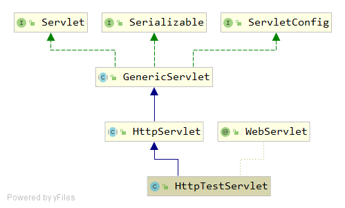
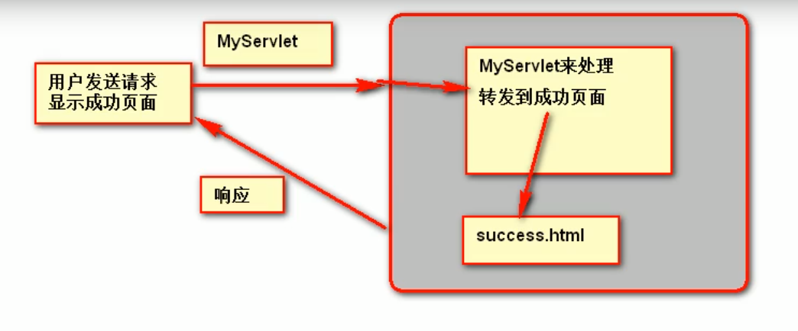
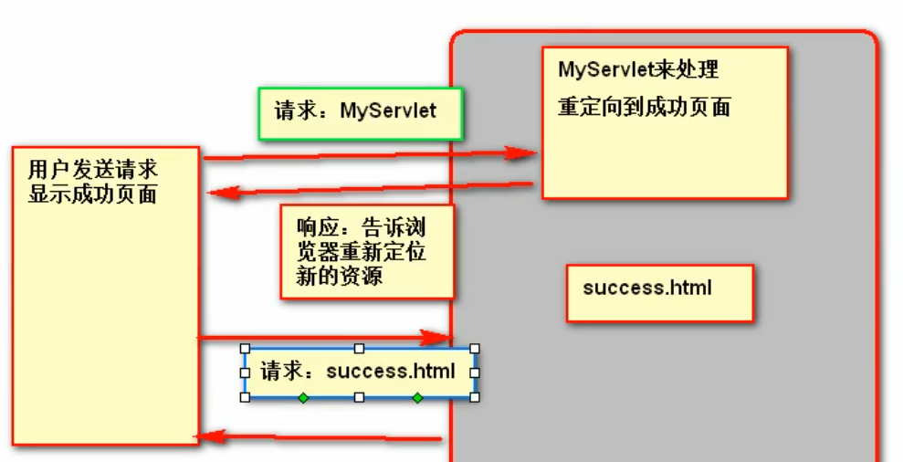

# 02_tomcat_Servlet

定义：

- 从广义上来讲，Servlet规范是Sun公司制定的一套技术标准，包含与Web应用相关的一系列接口，是Web应用实现方式的宏观解决方案。而具体的Servlet容器负责提供标准的实现。
- 从狭义上来讲，Servlet指的是javax.serlvet.Servlet接口及其子接口，也可以指实现了Servlet接口的实现类。
- Servlet作为服务器端的一个组件，它的本意是“服务器端的小程序”。Servlet的实例对象由Servlet容器负责创建；Servlet的方法由容器在特定情况下调用；Servlet容器会在Web应用卸载的时候销毁Servlet对象的实例。

官方文档：一个servlet就是一个小java程序，servelt运行在web服务器，servlet接收和响应来自客户端的请求，通过http；


作用：

- 接收请求
- 处理请求
- 完成响应


## HelloWorld

编写Servlet三步：

1. 创建自己的类HelloServlet，实现Servlet接口
2. 实现service方法
3. 在web.xml中配置servlet信息

测试：运行项目，在浏览器访问配置的url


代码：

```java
package top.tomxwd.servlet;

import javax.servlet.*;
import java.io.IOException;
import java.util.Enumeration;

/**
 * 一个Servlet只能处理一个指定的请求，
 * 应该指定servlet处理哪个请求，
 * 需要在web.xml文件里面配置servlet的详细信息
 * @author xieweidu
 * @createDate 2019-10-27 11:12
 */
public class HelloServlet implements Servlet {

    /**
     * 初始化
     * @param config
     * @throws ServletException
     */
    @Override
    public void init(ServletConfig config) throws ServletException {
        Enumeration<String> names = config.getInitParameterNames();
        while (names.hasMoreElements()) {
            String name = names.nextElement();
            System.out.println("name = " + name);
            String initParameter = config.getInitParameter(name);
            System.out.println("initParameter = " + initParameter);
        }
        System.out.println("-------------------");
        ServletContext servletContext = config.getServletContext();
        System.out.println("servletContext.getContextPath() = " + servletContext.getContextPath());
        System.out.println("-------------------");
        System.out.println("config.getServletName() = " + config.getServletName());
        System.out.println("初始化方法");
    }

    /**
     * 获取Servlet配置信息
     * @return
     */
    @Override
    public ServletConfig getServletConfig() {
        return null;
    }

    /**
     * 服务
     * @param req
     * @param res
     * @throws ServletException
     * @throws IOException
     */
    @Override
    public void service(ServletRequest req, ServletResponse res) throws ServletException, IOException {
        // service方法是用来处理来自客户端的请求
        System.out.println("我是HelloServlet！！！");
        // res用于响应浏览器
        res.getWriter().println("123");
    }

    /**
     * 获取Servlet信息，没什么用，直接返回一个String作为描述信息
     * @return
     */
    @Override
    public String getServletInfo() {
        return "HelloServlet信息";
    }

    /**
     * 销毁方法
     */
    @Override
    public void destroy() {
        System.out.println("销毁方法");
    }
}
```

web.xml

```xml
<?xml version="1.0" encoding="UTF-8"?>
<web-app xmlns="http://xmlns.jcp.org/xml/ns/javaee"
         xmlns:xsi="http://www.w3.org/2001/XMLSchema-instance"
         xsi:schemaLocation="http://xmlns.jcp.org/xml/ns/javaee http://xmlns.jcp.org/xml/ns/javaee/web-app_4_0.xsd"
         version="4.0">

    <!-- 在servlet标签里配置servlet的类信息 -->
    <servlet>
        <!-- 配置servlet的名字 -->
        <servlet-name>helloServlet</servlet-name>
        <!-- 配置servlet类的全名 -->
        <servlet-class>top.tomxwd.servlet.HelloServlet</servlet-class>
    </servlet>

    <!-- servlet映射信息 -->
    <servlet-mapping>
        <!-- servlet的名字 -->
        <servlet-name>helloServlet</servlet-name>
        <!-- 这个servlet用来处理哪个请求 -->
        <url-pattern>/hello</url-pattern>
    </servlet-mapping>

</web-app>
```

pom.xml

```xml
<dependencies>
    <!-- servlet -->
    <dependency>
        <groupId>javax.servlet</groupId>
        <artifactId>javax.servlet-api</artifactId>
        <version>3.0.1</version>
        <scope>provided</scope>
    </dependency>
    <!-- jsp -->
    <dependency>
        <groupId>javax.servlet.jsp</groupId>
        <artifactId>javax.servlet.jsp-api</artifactId>
        <version>2.2.1</version>
        <scope>provided</scope>
    </dependency>
    <!-- jstl -->
    <dependency>
        <groupId>javax.servlet</groupId>
        <artifactId>jstl</artifactId>
        <version>1.2</version>
    </dependency>
</dependencies>

<build>
    <plugins>
        <plugin>
            <groupId>org.apache.maven.plugins</groupId>
            <artifactId>maven-compiler-plugin</artifactId>
            <version>2.3.2</version>
            <configuration>
                <source>1.8</source>
                <target>1.8</target>
            </configuration>
        </plugin>
    </plugins>
</build>
```


## Servlet详解

在web.xml中配置的servlet-class标签指定全类名是为了让服务器通过全类名找到Servlet，通过反射创建实例。

web.xml关于servlet与servlet-mapping标签，servlet是给服务器反射创建实例，而servlet-mapping是用来指定servlet处理哪个请求。


在地址栏输入一个地址的时候经过的步骤：

1. 用户在浏览器地址栏输入：http://localhost:8080/hello请求，首先找是否有动态资源对应，没有就找静态资源。
2. 然后在url-pattern找是否有相应的映射地址，如果没有则404，如果有就找相应的servlet-name，通过servlet-name找到servlet的信息。
3. 那么找到servlet的信息，就可以找到servlet的类，然后初始化-->调用service方法。


### Servlet生命周期

Servlet是跑在Tomcat服务器上的。

Tomcat服务器---->Servlet容器；

Servlet的生命周期，Servlet从创建到销毁的过程。

当我们第一次访问HelloServlet的时候：

1. 创建一个Servlet对象
2. 调用Init方法，进行初始化
3. 调用service方法
4. 第n次调用，就只调用service方法来处理请求，整个运行期间只创建了一个servlet对象（**单实例、多线程**），因此不能写共享变量。
5. 正常停止服务器的时候会调用destory方法


### ServletConfig对象

ServletConfig封装的了当前servlet的配置信息。

```java
// 获取servelt的名字
String servletName = config.getServletName();
System.out.println("servletName = " + servletName);
System.out.println("------------------------------------");
// 获取servlet初始化参数
String username = config.getInitParameter("username");
System.out.println("username = " + username);
System.out.println("------------------------------------");
// 获取servlet上下文，代表当前的Web项目信息（一个web项目只有一个servletContext）
ServletContext servletContext = config.getServletContext();
```

**一个Servlet有一个ServletConfig对象，一个Web项目只有一个ServletContext对象。**

主要就是三个方法：

1. 获取servlet的名字
2. 获取servlet初始化参数
3. 获取servlet的上下文对象


### ServletContext对象

一个Web项目只有一个ServeltContext对象，代表整个Web项目；

作用：

1. 可以获取web项目的配置信息

   - 在web.xml配置：

     ```xml
     <!-- 配置web项目初始化参数 -->
     <context-param>
         <param-name>user</param-name>
         <param-value>root</param-value>
     </context-param>
     ```

   - 用ServletContext的getInitParameter()方法只能获取到web项目的初始化参数，而不能拿到servlet的初始化参数。

     ```java
     @Override
     public void init(ServletConfig config) throws ServletException {
         ServletContext servletContext = config.getServletContext();
         Enumeration<String> initParameterNames = servletContext.getInitParameterNames();
         while (initParameterNames.hasMoreElements()){
             String name = initParameterNames.nextElement();
             String initParameter = servletContext.getInitParameter(name);
             System.out.println("----------------------------------");
             System.out.println("name = " + name);
             System.out.println("initParameter = " + initParameter);
         }
     }
     ```

2.  可以获取web项目的路径getContextPath()

   ```java
   String contextPath = servletContext.getContextPath();
   System.out.println("contextPath = " + contextPath);
   ```

3. 获取资源的真实路径getRealPath()

   - 虚拟路径：是网络访问使用的，每一个虚拟路径应该对应一个实际的资源。
     - 静态资源：文件的形式
     - 动态资源：只是启动一段程序代码
   - 真实路径：文件在磁盘中的存储路径

4. 作为最大的域对象共享数据

   - 域对象：共享数据（跨区域共享数据）四大作用域对象
     - application域对象


### HttpServlet

HttpServlet是专门为了处理Http请求定制的Servlet

继承关系图：



```java
@WebServlet("/http")
public class HttpTestServlet extends HttpServlet {

    public HttpTestServlet() {
        super();
        System.out.println("构造器");
    }

    @Override
    protected void doGet(HttpServletRequest req, HttpServletResponse resp) throws ServletException, IOException {
        System.out.println("doGet");
    }

    @Override
    protected void doPost(HttpServletRequest req, HttpServletResponse resp) throws ServletException, IOException {
        System.out.println("doPost");
    }
}
```

可以看到调用的是doGet或者doPost方法，但是实际上我们知道需要调用的是Servlet接口的service方法才对。 


原理：


我们知道其实是调用service方法来处理请求的，但是从类继承图上看，以及跟入代码之后可以发现，顺序是Servlet接口service被调用，但是GenericServlet将service方法声明为抽象方法，所以HttpServlet对service方法进行实现，而service方法又调用了本地的service重载方法，再在这个重载的方法里判断method，然后调用指定的doGet或者doPost方法来进行处理请求。


### HttpServletRequest和HttpServletResponse

HttpServletRequest代表就是封装浏览器请求信息的对象，收到的浏览器的请求。

HttpServletResponse代表的就是发送浏览器的响应对象，封装了响应信息。


request：

- 正常的http请求：

  - 请求首行（get请求封装的参数在url里）
  - 请求头
  - 空行
  - 请求体（封装的请求参数-post）

- 获取参数：

  - req.getParameter("username")：返回一个String
  - req.getParameterValues("username")：返回一个String数组

- 获取请求头相关信息：

  - req.getHeader("User-Agent");

- 转发一个页面/资源

  - ```java
    RequestDispatcher requestDispatcher = req.getRequestDispatcher("index.jsp");
    requestDispatcher.forward(req,resp);
    ```

- 作为域对象共享数据


response：

- 可以给浏览器响应字符串
- 可以重定向到一个页面或者其他资源，重定向就是服务器告诉浏览器重新请求别的资源
  - resp.sendRedirect("success.html");


### 转发和重定向的区别

|                | 转发                      | 重定向              |
| -------------- | ------------------------- | ------------------- |
| 浏览器地址栏   | 不会变化                  | 会变化              |
| Request        | 同一个请求                | 两次请求            |
| API            | Request对象               | Response对象        |
| 位置           | 服务器内部完成            | 浏览器完成          |
| WEB-INF        | 可以访问                  | 不能访问            |
| 共享请求域数据 | 可以共享                  | 不可以共享          |
| 目标资源       | 必须是当前Web应用中的资源 | 不局限于当前Web应用 |

转发：



重定向：




## 响应乱码问题

设置响应信息：

```java
resp.setContentType("text/html");
resp.setCharacterEncoding("utf-8");
resp.getWriter().write("请求成功！");
```

或者：

```java
resp.setContentType("text/html;charset=utf-8");
```

或者：

```java
resp.setHeader("Content-Type","text/html;charset=utf-8");
```

**注意：**必须在获取流之前设置字符编码以及内容类型。


## Get\Post请求乱码

### Get乱码原因

浏览器对URL进行编码，而服务器对URL进行解码。因为在进入到具体的代码之前，URL就已经被服务器解码过了，所以设置request是没有作用的，因此用req.setCharacterEncoding("utf-8")并不能解决get方法乱码问题。

那么就需要在服务器对URL进行解析之前，设置UTF-8编码即可。

解决：

在服务器的配置目录里**修改server.xml**配置文件。

我们知道监听的是8080端口，而就是这个地方对URL进行接收并解析，所以修改：

```xml
<Connector port="8080" protocol="HTTP/1.1" connectionTimeout="20000" redirectPort="8443" URIEncoding="UTF-8" />
```


### Post乱码原因

浏览器将数据编码并提交给服务器，而服务器并不知道编码规则造成乱码；

解决：

```java
req.setCharacterEncoding("utf-8");
```

**注意：**必须要在取数据之前设置，否则取出来的还是乱码。


## 项目路径问题

绝对路径以/开始，也就是从根开始，那么就不会带上上下文路径了，所以需要用/上下文路径/资源路径；


请求转发，是从项目的根目录开始，所以不用加上下文路径；

重定向是从服务器的根目录开始，需要拼上上下文路径才行；

理由很简单，请求转发是服务器在做处理，那么上下文路径是可以确定的，而重定向是交给浏览器去做处理，所以需要再拼上上下文路径才行。


### 获取项目上下文路径的几种方式

1. `String contextPath = req.getContextPath();`
2. `String contextPath = getServletContext().getContextPath();`


### base标签

可以指定页面上所有路径的基础路径，所有路径都是以指定的基础路径开始，只有**相对路径**的写法，会按照base标签指定的基础路径来拼接新的路径。

在页面的head标签内加入：

```html
<base href="http://localhost:8080/test/">
```

也就是说以后所有的相对路径参考的都是base标签指定的路径，而不是当前资源。


## 类加载器加载资源

由于发布到服务器上之后，不可以用new File()来读取配置文件(.properties)信息，所以要用：

```java
properties.load(Xxx.class.getClassLoader().getResourceAsStream("jdbc.properties"));
```

可以看到是在WEB-INF/classes目录下，也就是类路径下进行加载；

**注意：**不可以用系统的类加载器。


