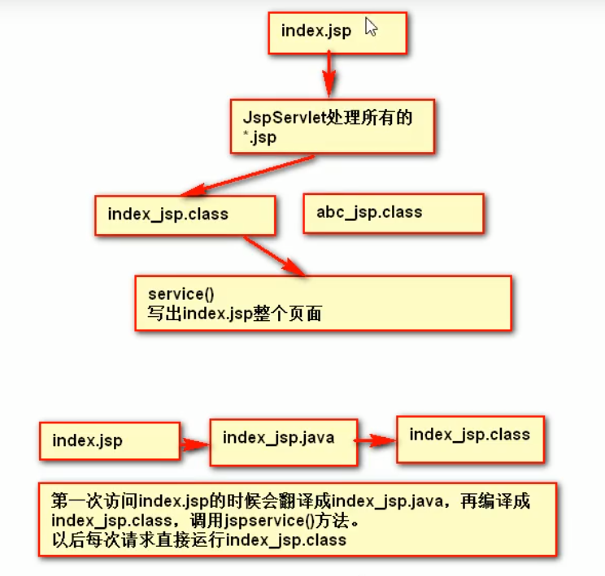
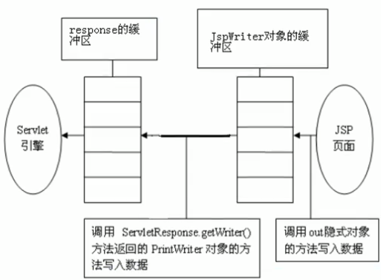

# 03_tomcat_JSP

Java Server Page

1. JSP的本质是一个Servlet，Servlet能做的事情JSP都能做；
2. JSP能够以HTML页面的方式呈现数据，是一个可以嵌入Java代码的HTML；
3. JSP不同于HTML，不能使用浏览器直接打开，而必须运行在Servlet容器中；


## JSP运行原理

在tomcat的webapp的work目录下，存放着运行时编译的文件，可以在里面看到JSP对应的java文件以及编译完的class文件。

**原理就是JSP是java文件；**

可以打开JSP对应的java文件，看到里面继承了HttpJspBase类，而HttpJspBase继承自HttpServlet，因此JSP就是一个Servlet。

而JSP是一个Servlet，那么是怎么加入到tomcat容器呢？可以到web.xml中看映射关系，其url-pattern是*.jsp，而其servlet-class是JspServlet，这个类处理所有.jsp结尾的请求。




## JSP基本语法

### JSP模板元素

JSP页面中的静态HTML内容称为JSP模板元素；


### JSP表达式

- <%= %>

JSP表达式（expression）提供了将一个Java变量或表达式的计算结果输出到客户端的简化方式，它将要输出的变量或表达式直接装在<%=和%>之中；

例如：Current time:<%=new java.util.Date()%>，注意：不可以写分号(;)，因为被传参到out.print()中的，所以不能够写分号；


### JSP脚本片段

- <% %>

在脚本片段里可以写java代码；

如：

```html
<%
   int age = 18;
   if(age >= 18){
   		out.print("Xxx")
   }else{
    	out.print("Xxx")
   }
%>
```

脚本片段会被原封不动的复制到.java文件中去。

JSP脚本片段还可以拆分出来写，但是必须要合法而且完整：

```html
<%
   int age = 18;
   if(age >= 18){
%>
   <h1>
       你好
    </h1>
<%
   }else{
    	out.print("Xxx")
   }
%>
```


### JSP声明

- <%! %>

如可以声明变量、方法等，也就是在service()方法外部编写的内容；


### JSP指令

- <%@ 指令名 属性名="值" %>

例如：

`<%@ page contentType="text/html;charset=gb2312"%>`：设置响应头信息

属性名部分是大小写敏感的。


JSP2.0中定义了三种指令：page、include、taglib；


三种指令的属性：

- page（定义页面如何解析）：
  - import：用来在页面导包
  - pageEncoding：指定页面使用的字符集，也是告诉JSP引擎使用指定的编码翻译
  - contentType：设置响应头，页面如何响应给浏览器
  - errorPage：指定发生错误去向的页面
  - isErrorPage：表示当前页面是一个错误页面，可以使用exception对象信息，如：
    - `<%=exception.getMessage()%>`获取错误信息
  - session：默认是true，当前页面是否参与会话，也就是是否可以使用session对象；
  - isELIgnored：是否忽略EL表达式，默认是false（不忽略）；
  - info：定义页面的信息（描述信息），在getServletInfo()里面return的信息；
- include（静态包含）：
  - `<%@ include 属性名="属性值"%>`，可以把另一个页面包含进来，采用的方式是将整个页面复制到service方法里，这里不编译include的页面；
- taglib：在页面引入标签库：
  - <%@ taglib 属性名=属性值%>


### JSP标签

JSP中内置了很多标签，每个标签都有不同的功能，就是执行一段代码；

- `<jsp:include>`：也是在页面包含另外一个页面，**动态包含**
  - page：页面路径
  - 把要包含的页面先翻译出来，再编译出来，再包含。
- `<jsp:forward page="Xxx.jsp">`：要转发的页面
  - `<jsp:param name="" value="">`：子标签，转发的时候带的参数；在请求中看不出来，而在后台实际上可以取得，因为是在父页面进行的请求，而设置参数的是在父页面jsp的servlet里，所以参数是在中途设置进去的。


### JSP九大隐含对象

包括五个常规对象以及四个域对象；

是我们在页面可以直接进行使用的对象。

- PageContext pageContext：代表当前页面对象
- HttpSession session：代表会话对象
- Throwable exception：代表当前页面捕获的异常对象
- ServletContext application：代表整个Web应用
- ServletConfig config：代表Servlet配置信息
- JspWriter out：代表可以在页面输出数据的out对象
- Object page = this：代表当前这个Servlet对象
- HttpServletRequest request：代表封装当次请求详细信息的对象
- HttpServletResponse response：代表当次响应的对象


#### 五个常规对象

- exception
- config
- out
- page
- response



out.write()和response.getWriter().write()，如果out没有调用flush()方法，会导致response永远输出在out之前。

**原理：**

out会写入到JspWriter对象的缓冲区，response会写入到response的缓冲区，而JspWriter缓冲区的东西会塞到response缓冲区，所以显示的时候是response在前。

所以如果要保证顺序，要在out调用完write之后再调用flush()方法。


#### 四大域对象

域对象用来在其他资源共享数据

- pageContext
  - getXxx方法可以获取所有其他的隐含对象
  - 作为域对象共享数据：只能在**当前页面共享数据**，离开页面就无法共享。
  - 通过setAttribute(key,value)共享内容；
  - 通过getAttribute(key)获取内容；

- request
  - 在同一个请求对象中共享数据，只要是同一次请求，就可以共享数据（请求转发可以共享，而重定向不行）
- session
  - 同一次会话共享数据，也就是打开浏览器——开始会话，关闭浏览器——结束会话
- application
  - 代表当前应用，只要在同一个Web应用中都可以共享数据，Web应用只要不卸载，都可以访问到。

| 域对象      | 作用范围    | 起始时间    | 结束时间    |
| ----------- | ----------- | ----------- | ----------- |
| pageContext | 当前JSP页面 | 页面加载    | 离开页面    |
| request     | 同一个请求  | 收到请求    | 响应        |
| session     | 同一个会话  | 开始会话    | 结束会话    |
| application | 当前Web应用 | Web应用加载 | Web应用卸载 |


## 获取Base路径

- request.getScheme()：获取协议名(http)
- request.getServerName()：获取服务器名
- request.getServerPort()：获取服务器端口

- request.getContentPath()：获取项目上下文路径


