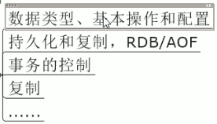
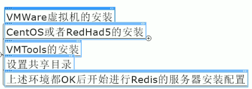
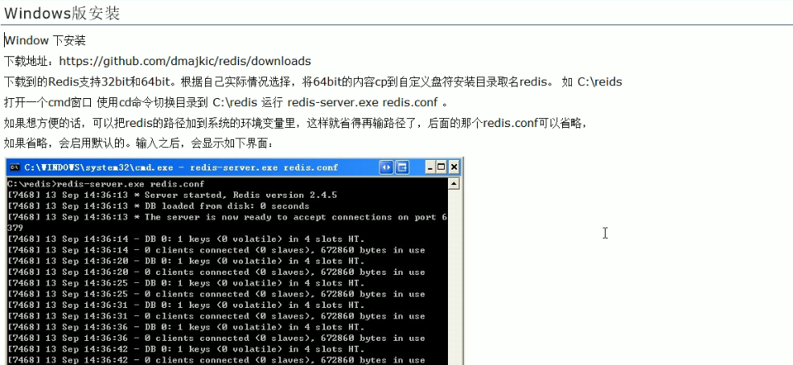
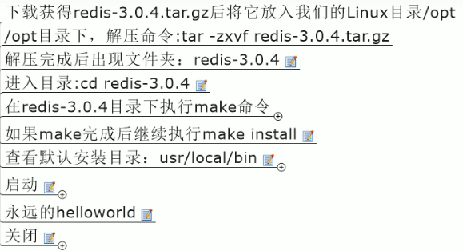
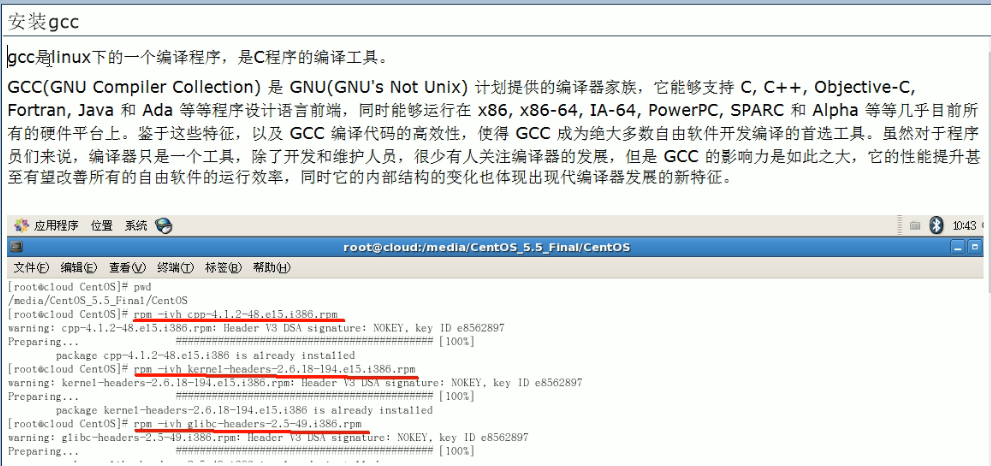
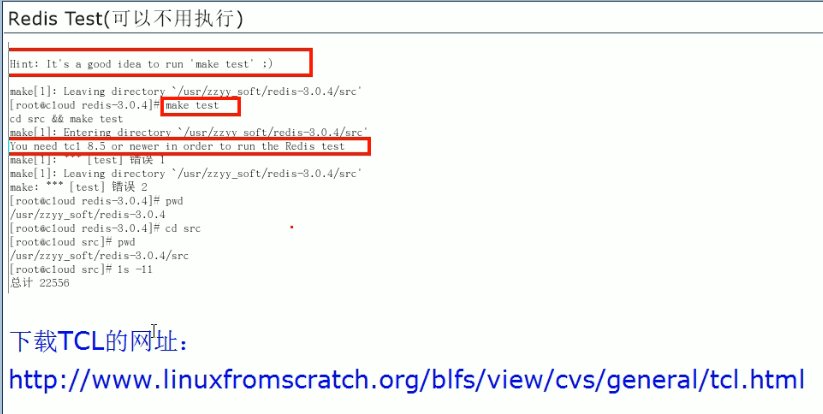
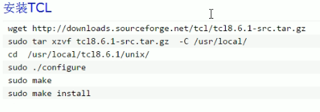
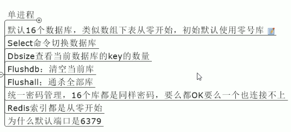

---
2019-08-06 14:40:46

---

# Redis_入门介绍

## 入门概述

### 是什么

### 能干嘛

### 去哪下

### 怎么玩

## VMWare+VMTools

## Redis的安装

### Windows版安装

### 重要提示：

### Linux版安装

1. 下载获得redis.tar.gz后将它放入我们的Linux目录/opt

2. /opt目录下，解压命令`tar -zxvf redis-xxx.tar.gz`

3. 解压完成后出现文件夹：redis-xxx

4. 进入目录：`cd redis-xxx`

5. 在redis目录下执行make命令

   - make报错，没有gcc

     

     **安装gcc：**

     能上网：yum install gcc-c++

     查看gcc版本：

     gcc -v

   - 二次make，没有Jemalloc/jemalloc.h没有那个文件或目录

     运行make distclean之后再make

   - Redis Test(可以不用执行)

     

     

6. 如果make完成后继续执行make install

7. 查看默认安装目录：usr/local/bin

8. 启动

   - 在根目录创建myredis文件夹，放配置文件

     `cp redis.conf /myredis`

   - 修改配置：
     
     - deamonize yes    pid文件在/var/run/redis.pid。
     - **protected-mode no**否则外部无法连接上Redis。

9. 永远的helloworld

   `redis-server /myredis/redis.conf`

   `redis-cli -p 6379`

   `shutdown 从客户端关闭redis`

10. 关闭

###  Redis启动后杂项基础知识讲解

1. 单进程；

   

2. select+角标命令切换数据库；

   默认16个库，`select 0`----`select 15`

3. Dbsize查看当前数据库key的数量；

4. Flushdb：清空当前库

5. Flushall：清空所有库

6. 统一密码管理：16个库都是同样密码，要么都ok要么一个也连接不上

7. Redis索引都是从0开始

8. 为什么默认是6379端口

   merz意大利歌手
   
   

## Redis数据类型

### Redis的五大数据类型

#### String（字符串）

#### Hash（哈希，类似Java里的Map）

#### List（列表）

#### Set（集合）

#### Zset（sorted set：有序集合）

### 哪里去获得Redis常见数据类型操作命令

[网站](http://redisdoc.com)

### Redis键(key)

#### 常用

| 序号 | 命令及描述                                                   |
| :--- | :----------------------------------------------------------- |
| 1    | [DEL key](https://www.runoob.com/redis/keys-del.html) 该命令用于在 key 存在时删除 key。 |
| 2    | [DUMP key](https://www.runoob.com/redis/keys-dump.html)  序列化给定 key ，并返回被序列化的值。 |
| 3    | [EXISTS key](https://www.runoob.com/redis/keys-exists.html)  检查给定 key 是否存在。 |
| 4    | [EXPIRE key](https://www.runoob.com/redis/keys-expire.html) seconds 为给定 key 设置过期时间，以秒计。 |
| 5    | [EXPIREAT key timestamp](https://www.runoob.com/redis/keys-expireat.html)  EXPIREAT 的作用和 EXPIRE 类似，都用于为 key 设置过期时间。 不同在于 EXPIREAT 命令接受的时间参数是 UNIX 时间戳(unix timestamp)。 |
| 6    | [PEXPIRE key milliseconds](https://www.runoob.com/redis/keys-pexpire.html)  设置 key 的过期时间以毫秒计。 |
| 7    | [PEXPIREAT key milliseconds-timestamp](https://www.runoob.com/redis/keys-pexpireat.html)  设置 key 过期时间的时间戳(unix timestamp) 以毫秒计 |
| 8    | [KEYS pattern](https://www.runoob.com/redis/keys-keys.html)  查找所有符合给定模式( pattern)的 key 。 |
| 9    | [MOVE key db](https://www.runoob.com/redis/keys-move.html)  将当前数据库的 key 移动到给定的数据库 db 当中。 |
| 10   | [PERSIST key](https://www.runoob.com/redis/keys-persist.html)  移除 key 的过期时间，key 将持久保持。 |
| 11   | [PTTL key](https://www.runoob.com/redis/keys-pttl.html)  以毫秒为单位返回 key 的剩余的过期时间。 |
| 12   | [TTL key](https://www.runoob.com/redis/keys-ttl.html)  以秒为单位，返回给定 key 的剩余生存时间(TTL, time to live)。 |
| 13   | [RANDOMKEY](https://www.runoob.com/redis/keys-randomkey.html)  从当前数据库中随机返回一个 key 。 |
| 14   | [RENAME key newkey](https://www.runoob.com/redis/keys-rename.html)  修改 key 的名称 |
| 15   | [RENAMENX key newkey](https://www.runoob.com/redis/keys-renamenx.html)  仅当 newkey 不存在时，将 key 改名为 newkey 。 |
| 16   | [TYPE key](https://www.runoob.com/redis/keys-type.html)  返回 key 所储存的值的类型。 |

#### 案例

- keys *
- exists key的名字，判断某个key 是否存在
- move key db ---> 移到其他库
- expire key 秒钟：为给定key设置过期时间
- ttl key：查看还有多少秒过期，-1表示不过期，-2表示已经过期
- type key：查看key的类型

### Redis字符串(String)

单值单value

#### 常用

| 序号 | 命令及描述                                                   |
| :--- | :----------------------------------------------------------- |
| 1    | [SET key value](https://www.runoob.com/redis/strings-set.html)  设置指定 key 的值 |
| 2    | [GET key](https://www.runoob.com/redis/strings-get.html)  获取指定 key 的值。 |
| 3    | [GETRANGE key start end](https://www.runoob.com/redis/strings-getrange.html)  返回 key 中字符串值的子字符 |
| 4    | [GETSET key value](https://www.runoob.com/redis/strings-getset.html) 将给定 key 的值设为 value ，并返回 key 的旧值(old value)。 |
| 5    | [GETBIT key offset](https://www.runoob.com/redis/strings-getbit.html) 对 key 所储存的字符串值，获取指定偏移量上的位(bit)。 |
| 6    | [MGET key1 [key2..\]](https://www.runoob.com/redis/strings-mget.html) 获取所有(一个或多个)给定 key 的值。 |
| 7    | [SETBIT key offset value](https://www.runoob.com/redis/strings-setbit.html) 对 key 所储存的字符串值，设置或清除指定偏移量上的位(bit)。 |
| 8    | [SETEX key seconds value](https://www.runoob.com/redis/strings-setex.html) 将值 value 关联到 key ，并将 key 的过期时间设为 seconds (以秒为单位)。 |
| 9    | [SETNX key value](https://www.runoob.com/redis/strings-setnx.html) 只有在 key 不存在时设置 key 的值。 |
| 10   | [SETRANGE key offset value](https://www.runoob.com/redis/strings-setrange.html) 用 value 参数覆写给定 key 所储存的字符串值，从偏移量 offset 开始。 |
| 11   | [STRLEN key](https://www.runoob.com/redis/strings-strlen.html) 返回 key 所储存的字符串值的长度。 |
| 12   | [MSET key value [key value ...\]](https://www.runoob.com/redis/strings-mset.html) 同时设置一个或多个 key-value 对。 |
| 13   | [MSETNX key value [key value ...\]](https://www.runoob.com/redis/strings-msetnx.html)  同时设置一个或多个 key-value 对，当且仅当所有给定 key 都不存在。 |
| 14   | [PSETEX key milliseconds value](https://www.runoob.com/redis/strings-psetex.html) 这个命令和 SETEX 命令相似，但它以毫秒为单位设置 key 的生存时间，而不是像 SETEX 命令那样，以秒为单位。 |
| 15   | [INCR key](https://www.runoob.com/redis/strings-incr.html) 将 key 中储存的数字值增一。 |
| 16   | [INCRBY key increment](https://www.runoob.com/redis/strings-incrby.html) 将 key 所储存的值加上给定的增量值（increment） 。 |
| 17   | [INCRBYFLOAT key increment](https://www.runoob.com/redis/strings-incrbyfloat.html) 将 key 所储存的值加上给定的浮点增量值（increment） 。 |
| 18   | [DECR key](https://www.runoob.com/redis/strings-decr.html) 将 key 中储存的数字值减一。 |
| 19   | [DECRBY key decrement](https://www.runoob.com/redis/strings-decrby.html) key 所储存的值减去给定的减量值（decrement） 。 |
| 20   | [APPEND key value](https://www.runoob.com/redis/strings-append.html) 如果 key 已经存在并且是一个字符串， APPEND 命令将指定的 value 追加到该 key 原来值（value）的末尾。 |

#### 案例

- set/get/del/append/strlen
- Incr/decr/incrby/decrby：一定要是数字才可以加减
- gentrange（0到-1表示全部）/setrange
- setex(set with expire)键秒值/setnx(set if not exist)
- mset/mget/msetnx批量操作m是more的意思，msetnx所有成功才成功
- getset（先get再set）

### Redis列表(List)

单值多value

#### 常用

| 序号 | 命令及描述                                                   |
| :--- | :----------------------------------------------------------- |
| 1    | [BLPOP key1 [key2 \] timeout](https://www.runoob.com/redis/lists-blpop.html)  移出并获取列表的第一个元素， 如果列表没有元素会阻塞列表直到等待超时或发现可弹出元素为止。 |
| 2    | [BRPOP key1 [key2 \] timeout](https://www.runoob.com/redis/lists-brpop.html)  移出并获取列表的最后一个元素， 如果列表没有元素会阻塞列表直到等待超时或发现可弹出元素为止。 |
| 3    | [BRPOPLPUSH source destination timeout](https://www.runoob.com/redis/lists-brpoplpush.html)  从列表中弹出一个值，将弹出的元素插入到另外一个列表中并返回它； 如果列表没有元素会阻塞列表直到等待超时或发现可弹出元素为止。 |
| 4    | [LINDEX key index](https://www.runoob.com/redis/lists-lindex.html)  通过索引获取列表中的元素 |
| 5    | [LINSERT key BEFORE\|AFTER pivot value](https://www.runoob.com/redis/lists-linsert.html)  在列表的元素前或者后插入元素 |
| 6    | [LLEN key](https://www.runoob.com/redis/lists-llen.html)  获取列表长度 |
| 7    | [LPOP key](https://www.runoob.com/redis/lists-lpop.html)  移出并获取列表的第一个元素 |
| 8    | [LPUSH key value1 [value2\]](https://www.runoob.com/redis/lists-lpush.html)  将一个或多个值插入到列表头部 |
| 9    | [LPUSHX key value](https://www.runoob.com/redis/lists-lpushx.html)  将一个值插入到已存在的列表头部 |
| 10   | [LRANGE key start stop](https://www.runoob.com/redis/lists-lrange.html)  获取列表指定范围内的元素 |
| 11   | [LREM key count value](https://www.runoob.com/redis/lists-lrem.html)  移除列表元素 |
| 12   | [LSET key index value](https://www.runoob.com/redis/lists-lset.html)  通过索引设置列表元素的值 |
| 13   | [LTRIM key start stop](https://www.runoob.com/redis/lists-ltrim.html)  对一个列表进行修剪(trim)，就是说，让列表只保留指定区间内的元素，不在指定区间之内的元素都将被删除。 |
| 14   | [RPOP key](https://www.runoob.com/redis/lists-rpop.html)  移除列表的最后一个元素，返回值为移除的元素。 |
| 15   | [RPOPLPUSH source destination](https://www.runoob.com/redis/lists-rpoplpush.html)  移除列表的最后一个元素，并将该元素添加到另一个列表并返回 |
| 16   | [RPUSH key value1 [value2\]](https://www.runoob.com/redis/lists-rpush.html)  在列表中添加一个或多个值 |
| 17   | [RPUSHX key value](https://www.runoob.com/redis/lists-rpushx.html)  为已存在的列表添加值 |

#### 案例

- lpush/rpush/lrange
- lpop/rpop
- lindex，按照索引获得元素，从上到下，可以想象成从左到右
- llen
- lrem key 删n个value，lrem list01 5 1（删除5个1）
- ltrim key 开始index 结束index，截取指定范围的值后再赋值给key
- rpoplpush 源列表 目的列表
- lset key index value
- linsert key before/after 值1 值2

#### 性能总结

- 是一个字符串链表，left、right都可以插入添加；
- 如果键不存在，创建新的链表；
- 如果键已存在，新增内容；
- 如果值全移除，对应的键也就消失了。
- 链表的操作无论是头和尾效率都极高，但假如是对中间元素进行操作，效率就惨淡了。

### Redis集合(Set)

单值多value

#### 常用

| 序号 | 命令及描述                                                   |
| :--- | :----------------------------------------------------------- |
| 1    | [SADD key member1 [member2\]](https://www.runoob.com/redis/sets-sadd.html)  向集合添加一个或多个成员 |
| 2    | [SCARD key](https://www.runoob.com/redis/sets-scard.html)  获取集合的成员数 |
| 3    | [SDIFF key1 [key2\]](https://www.runoob.com/redis/sets-sdiff.html)  返回给定所有集合的差集 |
| 4    | [SDIFFSTORE destination key1 [key2\]](https://www.runoob.com/redis/sets-sdiffstore.html)  返回给定所有集合的差集并存储在 destination 中 |
| 5    | [SINTER key1 [key2\]](https://www.runoob.com/redis/sets-sinter.html)  返回给定所有集合的交集 |
| 6    | [SINTERSTORE destination key1 [key2\]](https://www.runoob.com/redis/sets-sinterstore.html)  返回给定所有集合的交集并存储在 destination 中 |
| 7    | [SISMEMBER key member](https://www.runoob.com/redis/sets-sismember.html)  判断 member 元素是否是集合 key 的成员 |
| 8    | [SMEMBERS key](https://www.runoob.com/redis/sets-smembers.html)  返回集合中的所有成员 |
| 9    | [SMOVE source destination member](https://www.runoob.com/redis/sets-smove.html)  将 member 元素从 source 集合移动到 destination 集合 |
| 10   | [SPOP key](https://www.runoob.com/redis/sets-spop.html)  移除并返回集合中的一个随机元素 |
| 11   | [SRANDMEMBER key [count\]](https://www.runoob.com/redis/sets-srandmember.html)  返回集合中一个或多个随机数 |
| 12   | [SREM key member1 [member2\]](https://www.runoob.com/redis/sets-srem.html)  移除集合中一个或多个成员 |
| 13   | [SUNION key1 [key2\]](https://www.runoob.com/redis/sets-sunion.html)  返回所有给定集合的并集 |
| 14   | [SUNIONSTORE destination key1 [key2\]](https://www.runoob.com/redis/sets-sunionstore.html)  所有给定集合的并集存储在 destination 集合中 |
| 15   | [SSCAN key cursor [MATCH pattern\] [COUNT count]](https://www.runoob.com/redis/sets-sscan.html)  迭代集合中的元素 |

#### 案例

- sadd/smemebers/sismember
- scard，获取集合里面的元素个数
- srem key value删除集合中的元素
- srandmember key某个整数（随机出几个数）
- spop key随机出栈
- smove key1 key2 在key1里的某个值赋给key2
- 数学集合类
  - 差集：sdiff
  - 交集：sinter
  - 并集：sunion

### Redis哈希(Hash)

KV模式不变，但V是一个键值对

#### 常用

| 序号 | 命令及描述                                                   |
| :--- | :----------------------------------------------------------- |
| 1    | [HDEL key field1 [field2\]](https://www.runoob.com/redis/hashes-hdel.html)  删除一个或多个哈希表字段 |
| 2    | [HEXISTS key field](https://www.runoob.com/redis/hashes-hexists.html)  查看哈希表 key 中，指定的字段是否存在。 |
| 3    | [HGET key field](https://www.runoob.com/redis/hashes-hget.html)  获取存储在哈希表中指定字段的值。 |
| 4    | [HGETALL key](https://www.runoob.com/redis/hashes-hgetall.html)  获取在哈希表中指定 key 的所有字段和值 |
| 5    | [HINCRBY key field increment](https://www.runoob.com/redis/hashes-hincrby.html)  为哈希表 key 中的指定字段的整数值加上增量 increment 。 |
| 6    | [HINCRBYFLOAT key field increment](https://www.runoob.com/redis/hashes-hincrbyfloat.html)  为哈希表 key 中的指定字段的浮点数值加上增量 increment 。 |
| 7    | [HKEYS key](https://www.runoob.com/redis/hashes-hkeys.html)  获取所有哈希表中的字段 |
| 8    | [HLEN key](https://www.runoob.com/redis/hashes-hlen.html)  获取哈希表中字段的数量 |
| 9    | [HMGET key field1 [field2\]](https://www.runoob.com/redis/hashes-hmget.html)  获取所有给定字段的值 |
| 10   | [HMSET key field1 value1 [field2 value2 \]](https://www.runoob.com/redis/hashes-hmset.html)  同时将多个 field-value (域-值)对设置到哈希表 key 中。 |
| 11   | [HSET key field value](https://www.runoob.com/redis/hashes-hset.html)  将哈希表 key 中的字段 field 的值设为 value 。 |
| 12   | [HSETNX key field value](https://www.runoob.com/redis/hashes-hsetnx.html)  只有在字段 field 不存在时，设置哈希表字段的值。 |
| 13   | [HVALS key](https://www.runoob.com/redis/hashes-hvals.html)  获取哈希表中所有值 |
| 14   | HSCAN key cursor [MATCH pattern] [COUNT count]  迭代哈希表中的键值对。 |

#### 案例

- **hset/hget/hmset/hmget/hgetall/hdel**
- hlen
- hexists key 在key里面的某个值的key
- **hkeys/hvals**
- hincrby/hincrbyfloat
- hsetnx

### Redis有序集合Zset(sorted set)

在set基础上，加一个score值，之前set是k1 v1 v2 v3，现在zset是k1 socre1 v1 score2 v2

#### 常用

| 序号 | 命令及描述                                                   |
| :--- | :----------------------------------------------------------- |
| 1    | [ZADD key score1 member1 [score2 member2\]](https://www.runoob.com/redis/sorted-sets-zadd.html)  向有序集合添加一个或多个成员，或者更新已存在成员的分数 |
| 2    | [ZCARD key](https://www.runoob.com/redis/sorted-sets-zcard.html)  获取有序集合的成员数 |
| 3    | [ZCOUNT key min max](https://www.runoob.com/redis/sorted-sets-zcount.html)  计算在有序集合中指定区间分数的成员数 |
| 4    | [ZINCRBY key increment member](https://www.runoob.com/redis/sorted-sets-zincrby.html)  有序集合中对指定成员的分数加上增量 increment |
| 5    | [ZINTERSTORE destination numkeys key [key ...\]](https://www.runoob.com/redis/sorted-sets-zinterstore.html)  计算给定的一个或多个有序集的交集并将结果集存储在新的有序集合 key 中 |
| 6    | [ZLEXCOUNT key min max](https://www.runoob.com/redis/sorted-sets-zlexcount.html)  在有序集合中计算指定字典区间内成员数量 |
| 7    | [ZRANGE key start stop [WITHSCORES\]](https://www.runoob.com/redis/sorted-sets-zrange.html)  通过索引区间返回有序集合成指定区间内的成员 |
| 8    | [ZRANGEBYLEX key min max [LIMIT offset count\]](https://www.runoob.com/redis/sorted-sets-zrangebylex.html)  通过字典区间返回有序集合的成员 |
| 9    | [ZRANGEBYSCORE key min max [WITHSCORES\] [LIMIT]](https://www.runoob.com/redis/sorted-sets-zrangebyscore.html)  通过分数返回有序集合指定区间内的成员 |
| 10   | [ZRANK key member](https://www.runoob.com/redis/sorted-sets-zrank.html)  返回有序集合中指定成员的索引 |
| 11   | [ZREM key member [member ...\]](https://www.runoob.com/redis/sorted-sets-zrem.html)  移除有序集合中的一个或多个成员 |
| 12   | [ZREMRANGEBYLEX key min max](https://www.runoob.com/redis/sorted-sets-zremrangebylex.html)  移除有序集合中给定的字典区间的所有成员 |
| 13   | [ZREMRANGEBYRANK key start stop](https://www.runoob.com/redis/sorted-sets-zremrangebyrank.html)  移除有序集合中给定的排名区间的所有成员 |
| 14   | [ZREMRANGEBYSCORE key min max](https://www.runoob.com/redis/sorted-sets-zremrangebyscore.html)  移除有序集合中给定的分数区间的所有成员 |
| 15   | [ZREVRANGE key start stop [WITHSCORES\]](https://www.runoob.com/redis/sorted-sets-zrevrange.html)  返回有序集中指定区间内的成员，通过索引，分数从高到底 |
| 16   | [ZREVRANGEBYSCORE key max min [WITHSCORES\]](https://www.runoob.com/redis/sorted-sets-zrevrangebyscore.html)  返回有序集中指定分数区间内的成员，分数从高到低排序 |
| 17   | [ZREVRANK key member](https://www.runoob.com/redis/sorted-sets-zrevrank.html)  返回有序集合中指定成员的排名，有序集成员按分数值递减(从大到小)排序 |
| 18   | [ZSCORE key member](https://www.runoob.com/redis/sorted-sets-zscore.html)  返回有序集中，成员的分数值 |
| 19   | [ZUNIONSTORE destination numkeys key [key ...\]](https://www.runoob.com/redis/sorted-sets-zunionstore.html)  计算给定的一个或多个有序集的并集，并存储在新的 key 中 |
| 20   | [ZSCAN key cursor [MATCH pattern\] [COUNT count]](https://www.runoob.com/redis/sorted-sets-zscan.html)  迭代有序集合中的元素（包括元素成员和元素分值） |

#### 案例

- zadd/zrange zrange最后可以加withscores
- zrangebyscore key 开始score 结束score
  - withscores
  - (score 不包含，即开区间
  - limit作用是返回限制，limit  开始index 多少步，类似分页
- zrem key 某score下对应的value值，作用是删除元素
- zcard/zcount key score区间/zrank key values值，作用是获得下标值/zscore key对应值，获得分数
- zrevrank key values值，作用是逆序获得下标值
- zrevrange
- zrevrangebyscore key **结束score 开始score**