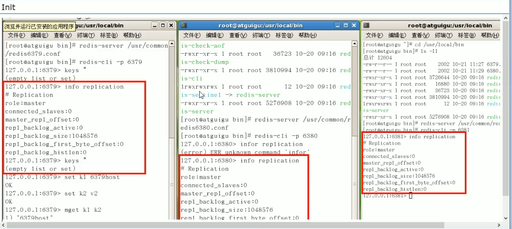
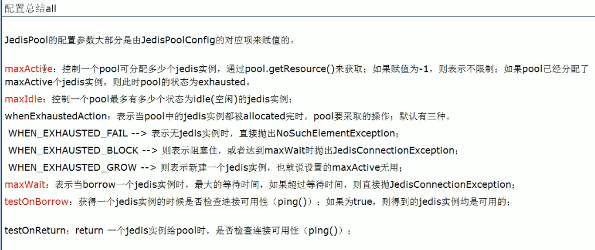

---
2019-08-08 15:27:33

---

# Redis的主从复制（Master/Slave)

## Redis的主从复制是什么

>  [官网文档](https://redis.io/topics/replication)
>
>  [文档2](http://redisdoc.com/index.html)

也就是我们所说的主从复制，主机数据更新后根据配置和策略，自动同步到备机的master/slave机制，Master以写为主，Slave以读为主。

## Redis的主从复制能干嘛

- 读写分离
- 容灾恢复

## Redis的主从复制怎么用

1. 配从（从库）不配主（主库）

2. 从库配置：slaveof 主库ip 主库端口

   - 每次和master断开之后，都需要重新连接，除非你配置进redis.conf文件
   - info replication

3. 修改配置文件细节操作

   - 拷贝多个redis.conf文件
   - 开启daemonize yes
   - 关闭protected-mode
   - bind也去掉
   - Pid文件名字
   - 指定端口
   - log文件名字
   - dump.rdb名字

4. 常用3招

   可以用`info replication`查看复制信息。

   - 一主二仆

     - init

       

     - 一个Master两个Slave

     - 日志查看

     - 主从问题演示

       - 主挂了，从原地待命
       - 从挂了，重新连接，建立从关系，继续使用

   - 薪火相传

     - 上一个slave可以是下一个slave的master，slave同样可以接收其他salves的连接和同步请求，那么该slave作为了链条中下一个master，可以有效减轻master的写压力
     - 中途变更转向：会清除之前的数据，重新建立拷贝最新的
     - slaveof 新主库IP 新主库端口

   - 反客为主

     - slaveof no one，脱离slave，然后让其他还存活的slaveof这部master

## Redis复制的原理


- slave启动成功连接到master后发送一个sync命令。

- master接到命令启动后台的存盘进程，同时收集所有接收到的用于修改数据集命令，在后台进程执行完毕之后，master将传送整个数据文件到slave，以完成一次完全同步。

- 全量复制：slave服务在接收到数据库文件数据后，将其存盘并加载到内存中。

- 增量复制：master继续将新的所有收集到的修改命令依次传给slave，完成同步。

- 但是只要是重新连接master，一次完全同步（全量复制）将被自动执行。

## Redis的哨兵模式

- 哨兵模式是什么

  反客为主的自动版，能够后台监控主机是否故障，如果故障了根据投票数自动将库转为主库

- 使用步骤：

  1. 调整结构，6379带80、81
  2. 在解压的redis目录下有sentinel.conf文件，复制出来修改即可，要把protected mode、port、log、pidfile、bind、daemonize 修改。（daemonize可以no，方便查看日志输出）
  3. 配置哨兵，填写内容
     - sentinel monitor 被监控数据库名字（自己起的名字）127.0.0.1 6379 1
     - **上面最后一个数字1，表示主机挂掉后sentinel投票看让谁接替成为主机，得票数多少后成为主机**
  4. 启动哨兵
     - redis-sentinel /mybatis/sentinel.conf，目录可以依照各自的实际情况进行配置。
  5. 正常主从演示
  6. 原有master挂了
     - 直接用客户端shutdown服务。
  7. 投票新选
  8. 重新主从继续开工，info replication查看信息
  9. 问题：如果之前的master重启，会不会双master冲突？

- 一组sentinel能同时监控多个master

```shell
protected-mode no
port 12385
daemonize yes
pidfile "/var/run/redis-sentinel.pid"
logfile "12385.log"
dir "/myredis"
sentinel myid 92c44e25dfdd05250f25b2d44bbf2a11cf230e4f
sentinel deny-scripts-reconfig yes
sentinel monitor mymaster 120.79.145.202 12386 1
sentinel config-epoch mymaster 3
sentinel leader-epoch mymaster 3
# Generated by CONFIG REWRITE
sentinel known-replica mymaster 120.79.145.202 12388
sentinel known-replica mymaster 120.79.145.202 12387
sentinel current-epoch 3
```

可以看详细的英文注释，这里不做多解释，注意有的默认时长是30秒、3分钟、5分钟的，没生效的话看sentinel的日志，看看是不是还没到时间。


## Redis复制的缺点

### 复制的延时
由于所有的写操作都是先在Master上操作，然后同步更新到Slave上，所以从Master同步到Slave机器有一定的延迟，当系统很繁忙的时候，延迟问题会更加严重，Slave机器数量的增加也会使这个问题更加严重。


## Jedis

### Jedis所需要的jar包

- Commons-pool-1.6.jar
- Jedis-2.1.0.jar


### Jedis常用操作

#### 测试联通性

pom.xml

```xml
<dependency>
    <groupId>redis.clients</groupId>
    <artifactId>jedis</artifactId>
    <version>3.1.0</version>
</dependency>
<dependency>
    <groupId>org.apache.commons</groupId>
    <artifactId>commons-pool2</artifactId>
    <version>2.6.2</version>
</dependency>
```

测试：

```java
@Test
public void testPing() {
    Jedis jedis = new Jedis("XxxHost",6379);
    System.out.println("jedis.ping() = " + jedis.ping());
    jedis.close();
}
```

结果：

```
jedis.ping() = PONG
```


#### 5+1

- 一个key
- 五大数据类型

#### 事务提交

- 日常

  ```java
  public class JedisTxTest {
  
      private Jedis jedis;
  
      @Before
      public void before(){
          this.jedis = new Jedis("tomxwd.top",12388);
      }
  
      @After
      public void after(){
          jedis.close();
      }
  
      @Test
      public void test(){
          Transaction transaction = jedis.multi();
          transaction.set("k4","v4");
          transaction.set("k5","v5");
          //transaction.exec();
          transaction.discard();
      }
  
  }
  ```

- 加锁

  通俗点讲，watch命令就是标记一个键，如果标记了一个键，在提交事务前如果该键被别人修改过，那事务就会失败，这种情况通常可以在程序中重新再尝试一次。

  首先标记了键balance，然后检查余额是否足够，不足就取消标记，并不做扣减；

  足够的话，就启动事务进行更新操作；

  如果在此期间键balance被其他人修改，那在提交事务（执行exec）时就会报错，

  程序中通常可以捕获这类错误再重新执行一次，直到成功。

  ```java
  public class JedisTxTest {
  
      private Jedis jedis;
  
      @Before
      public void before(){
          this.jedis = new Jedis("tomxwd.top",12388);
      }
  
      @After
      public void after(){
          jedis.close();
      }
  
      public boolean transMethod(Jedis jedis){
          int balance;//可用余额
          int debt;//欠额
          int amtToSubtract = 10;//实刷额度
          jedis.watch("balance");
          // 下面这句是为了模拟其他程序修改了这个balance
          jedis.set("balance","5");
          balance = Integer.parseInt(jedis.get("balance"));
          if(balance < amtToSubtract){
              jedis.unwatch();
              System.out.println("已被修改");
              return false;
          } else {
              System.out.println("-------transaction--------");
              Transaction tx = jedis.multi();
              tx.decrBy("balance",amtToSubtract);
              tx.incrBy("debt",amtToSubtract);
              tx.exec();
              balance = Integer.parseInt(jedis.get("balance"));
              debt = Integer.parseInt(jedis.get("debt"));
              System.out.println("balance = " + balance);
              System.out.println("debt = " + debt);
              return true;
          }
      }
  
      @Test
      public void test(){
          JedisTxTest test = new JedisTxTest();
          boolean retValue = test.transMethod(this.jedis);
          System.out.println("retValue = " + retValue);
      }
  
  }
  ```

#### 主从复制

6379和6380先启动，各自独立。

主写，从读；

### JedisPool

- 获取Jedis实例需要从JedisPool中获取

- 用完Jedis实例需要返还给JedisPool

- 如果Jedis在使用过程中出错，也需要还给JedisPool

- 案例见代码：

  - JedisPoolUtil

    ```java
    public class JedisPoolUtil {
    
        private JedisPoolUtil(){
    
        }
    
        private static volatile JedisPool jedisPool = null;
    
        public static JedisPool getJedisPoolInstance(){
    
            if(null==jedisPool){
                synchronized (JedisPoolUtil.class){
                    if(null==jedisPool){
                        JedisPoolConfig poolConfig = new JedisPoolConfig();
                        poolConfig.setMaxIdle(32);
                        poolConfig.setMaxTotal(1000);
                        poolConfig.setMaxWaitMillis(100*1000);
                        poolConfig.setTestOnBorrow(true);
                        jedisPool = new JedisPool(poolConfig,"tomxwd.top",12388);
                    }
                }
            }
            return jedisPool;
        }
    
        public static void release(Jedis jedis){
            if(null!=jedis){
                jedis.close();
            }
        }
    
    }
    ```

  - Demo5

    **JedisPool.getResource();**

    ```java
    public class PoolTest {
    
        @Test
        public void test(){
            JedisPool jedisPool = JedisPoolUtil.getJedisPoolInstance();
            Jedis jedis = null;
            try {
                jedis = jedisPool.getResource();
                jedis.set("aaa","bbb");
            } catch (Exception e){
                e.printStackTrace();
            } finally {
                JedisPoolUtil.release(jedis);
            }
        }
    
    }
    ```

- 配置总结all

  